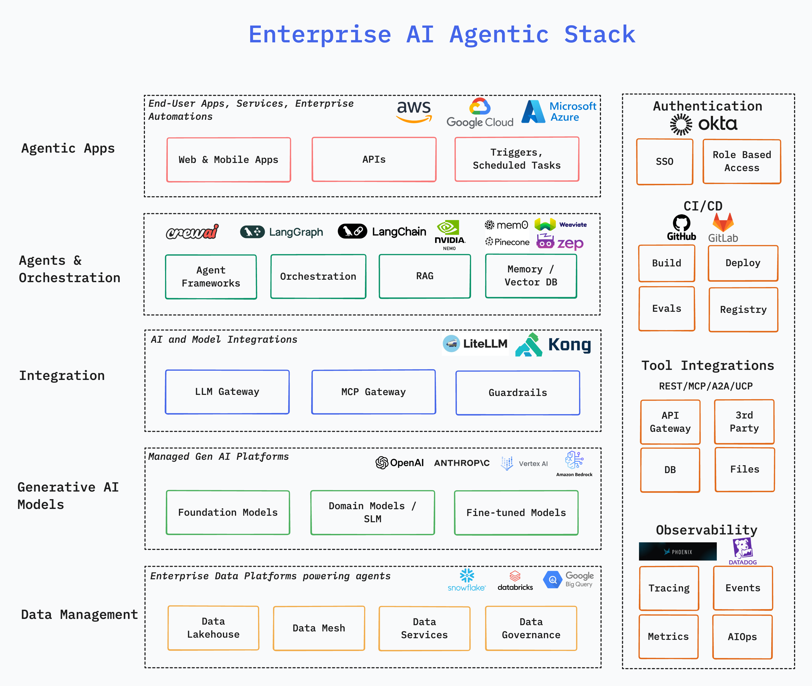

# Agent Reference Architecture

A comprehensive guide to designing, building, and deploying enterprise-grade autonomous agents and multi-agent systems.

## Overview

This section provides architectural patterns, design principles, and best practices for implementing robust AI agents. It serves as a reference for understanding core components, communication patterns, and design considerations when building agent-based systems.

## Key Components



### 1. **Data Management**
- **Data Lakehouse**: Enterprise data store for structured, semi-structured and unstructured data
- **Data Mesh**: Data as a product owned by domain teams
- **Data Services**: Serving data as well defined services with contracts
- **Data Governance**: Ensuring responsible and compliant use of personal and business data
- ***Leading Industry Solutions***: Snowflake, Databricks, Google BigQuery

### 2. **Generative AI Models**
- **Foundation Models**: Production-grade large langugage models trained with huge data corpus
- **Domain Models / SLM**: Pre-trained models on specific domain data (financial etc.) that are trained to perform well for specific set of use cases
- **Fine-tuned Models**: Customized models by an enterprise that works well with their own data corpus and use cases
- ***Leading Industry Solutions***: OpenAI, Anthropic, Amazon Bedrock, Google Vertex AI

### 3. **Integration**
- **LLM Gateway**: Seamless and controlled access to various LLMs
- **MCP Gateway**: Controlled access to various MCP Serves and Tools
- **Guardrails**: Controls and guardrais around personal data, cost, compliance, enterprise guidelines etc.

### 4. **Agents & Orchestration**
- **Agent Frameworks**: Enterprise commercial and open-source frameworks to build AI agents
- **Orchestration**: Coordination and management of multiple AI agents working together to accomplish complex tasks through structured workflows and communication patterns.
- **RAG**: Knowledge base and RAG apps
- **Memory / Vector DB**: Session and long-term memory store for agentic apps

### 5. **Agentic Apps**
- **Web & Mobile Apps**: End-user apps across web and mobile platforms
- **APIs**: Agentic apps as services to internal and external consumers
- **Triggers, Scheduled Tasks**: Entperprise automation and scheduled jobs

### 6. **Cross-Cutting Components**
- **Authentications**: Sanitizing and validating user inputs
  - **SSO**
  - **Role-based Access (RBA)**
- **CI/CD**
  - **Build**
  - **Deploy**
  - **Evals**
  - **Registry**
- **Tool Integrations**
  - API Gateway
  - 3rd Party Services
  - DB
  - Files
- Observability
  - Tracing
  - Events
  - Metrics
  - AIOps 

## Architecture Patterns

### Simple Agent Pattern
```
User Input → [Agent] → Tool Calls → [Agent] → Output
  ↑                                            ↓
  └────────────────────────────────────────────┘
           (Agentic Loop with Reflection)
```

### Multi-Agent Pattern
```
┌─────────┐  ┌─────────┐  ┌─────────┐
│ Agent 1 │  │ Agent 2 │  │ Agent 3 │
└────┬────┘  └────┬────┘  └────┬────┘
     └─────────────┼─────────────┘
                   │
            ┌──────▼──────┐
            │ Coordinator │
            └──────┬──────┘
                   │
              ┌────▼────┐
              │ User    │
              └─────────┘
```

### Sequential vs. Parallel Execution
- **Sequential**: One agent completes, passes results to next
- **Parallel**: Multiple agents work independently, results merged
- **Conditional**: Execution path based on intermediate results

## Design Considerations

### 1. **Reliability & Resilience**
- Implement exponential backoff for retries
- Use circuit breakers for external services
- Graceful degradation when tools fail
- Comprehensive error handling and logging

### 2. **Performance**
- Cache frequently accessed data and tool results
- Batch multiple operations when possible
- Use streaming for long-running operations
- Monitor latency and optimize bottlenecks

### 3. **Scalability**
- Design for stateless agent instances
- Use message queues for asynchronous processing
- Implement proper load balancing
- Consider horizontal scaling of components

### 4. **Security**
- Validate and sanitize all inputs
- Implement principle of least privilege for tools
- Use secure credential management
- Audit all agent actions and decisions

### 5. **Explainability**
- Log reasoning chains and decision points
- Provide clear explanations for actions taken
- Track confidence scores and uncertainty
- Enable users to understand agent behavior

## Framework Comparison

This repository implements reference agents using three popular frameworks:

| Aspect | CrewAI | LangGraph | Nvidia NeMo |
|--------|--------|-----------|-------------|
| **Ease of Use** | High | Medium | Medium-High |
| **Customization** | Medium | High | High |
| **Multi-Agent** | Built-in | Flexible | Built-in |
| **Community** | Growing | Large | Enterprise |
| **State Management** | Simple | Sophisticated | Advanced |

## Getting Started

1. **Understand the patterns**: Review the architecture diagrams and component descriptions
2. **Study the examples**: Explore implementations in `multi-agent-samples/`
3. **Choose a framework**: Select based on your use case and requirements
4. **Apply templates**: Use `doc-templates/` for design and specification documents
5. **Evaluate thoroughly**: Leverage tools in `agent-evals/` to validate your agent

## Best Practices

### Design Phase
- [ ] Define clear agent goals and success criteria
- [ ] Document all capabilities and limitations
- [ ] Plan for failure modes and recovery
- [ ] Consider privacy and security implications

### Implementation Phase
- [ ] Start simple, add complexity incrementally
- [ ] Implement comprehensive logging
- [ ] Test edge cases and failure scenarios
- [ ] Monitor resource consumption

### Deployment Phase
- [ ] Set up observability and monitoring
- [ ] Implement rate limiting and safeguards
- [ ] Create rollback procedures
- [ ] Gather user feedback and metrics

## Related Resources

- **Design Specifications**: See [agent-design-spec.md](../doc-templates/agent-design-spec.md) for detailed template
- **Evaluation Framework**: Visit [agent-evals/](../agent-evals/) for testing your agents
- **Multi-Agent Examples**: Check [multi-agent-samples/](../multi-agent-samples/) for framework-specific implementations
- **Learning Materials**: Browse [learning-resources/](../learning-resources/) for additional references

## Key Takeaways

1. **Modularity**: Build agents from composable, reusable components
2. **Transparency**: Maintain clear audit trails and explainability
3. **Robustness**: Implement comprehensive error handling and recovery
4. **Governance**: Enforce safety constraints and regulatory compliance
5. **Observability**: Monitor and measure agent behavior continuously

## Next Steps

- Review the [Agent Ecosystem](../agent-ecosystem/README.md) for a comprehensive overview
- Explore the [multi-agent code-reviewers example](../multi-agent-samples/crewai/code-reviewers/)
- Start with the [agent-design-spec template](../doc-templates/agent-design-spec.md) for your own project

---

*This reference architecture is part of AI Agent School—a learning and prototyping playground for autonomous agents and multi-agent systems.*
