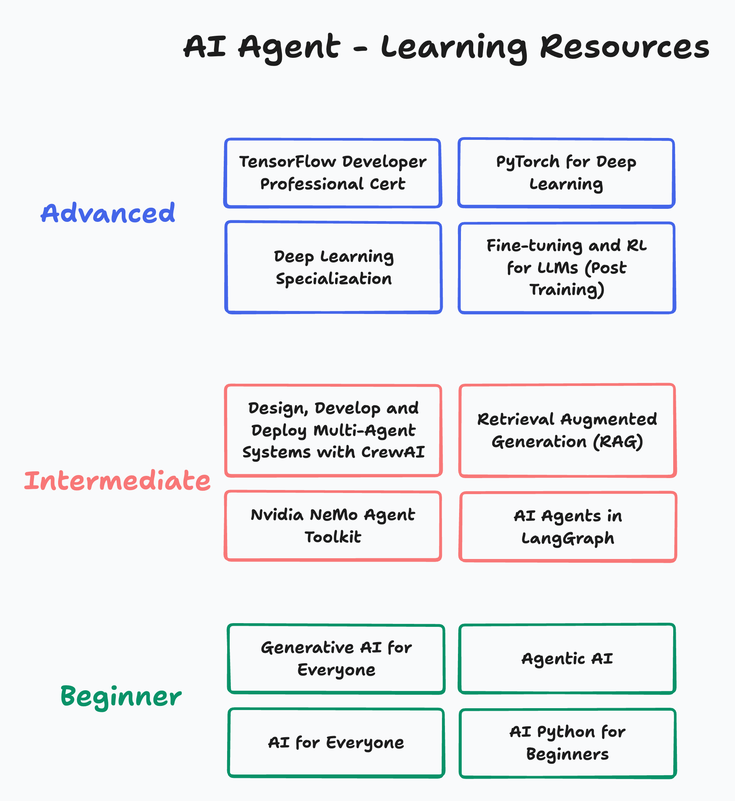

# AI Agent Learning Resources

To deeply understand and build agents, you can use the following learning resources from DeepLearning AI.

"Beginner" and "Intermediate" resources are essential, if you are serious about building production-grade AI Agents.  

"Advanced" resources help you go behind the scenes and gain a lot of depth.

## Beginner Resources

- [AI for Everyone](https://learn.deeplearning.ai/courses/ai-for-everyone)
- [AI Python for Beginners](https://learn.deeplearning.ai/courses/ai-python-for-beginners)
- [Generative AI for Everyone](https://learn.deeplearning.ai/courses/generative-ai-for-everyone/)
- [Agentic AI](https://learn.deeplearning.ai/courses/agentic-ai/)

## Intermediate Resources

- [Design, Develop and Deploy Multi-Agent Systems with CrewAI](https://learn.deeplearning.ai/courses/design-develop-and-deploy-multi-agent-systems-with-crewai/)
- [Retrieval Augmented Generation (RAG)](https://learn.deeplearning.ai/courses/retrieval-augmented-generation)
- [Nvidia NeMo Agent Toolkit](https://learn.deeplearning.ai/courses/nvidia-nat-making-agents-reliable)
- [AI Agents in LangGraph](https://learn.deeplearning.ai/courses/ai-agents-in-langgraph)

## Advanced Resources

- [Deep Learning Specialization](https://learn.deeplearning.ai/specializations/deep-learning)
- [PyTorch for Deep Learning](https://learn.deeplearning.ai/specializations/pytorch-for-deep-learning-professional-certificate)
- [TensorFlow for Deep Learning](https://learn.deeplearning.ai/specializations/tensorflow-developer-professional-certificate)
- [Fine-tuning and Reinforcement Learning (RL) for LLMs](https://learn.deeplearning.ai/courses/fine-tuning-and-reinforcement-learning-for-llms-intro-to-post-training)

## Additional Resources

- [Evaluating AI Agents](https://learn.deeplearning.ai/courses/evaluating-ai-agents/)
- [Governing AI Agents](https://learn.deeplearning.ai/courses/governing-ai-agents)
- [ACP Agent Communication Protocol](https://codelabs.developers.google.com/intro-a2a-purchasing-concierge#0)
- [MCP Build Rich-Context AI Apps](https://learn.deeplearning.ai/courses/mcp-build-rich-context-ai-apps-with-anthropic)
